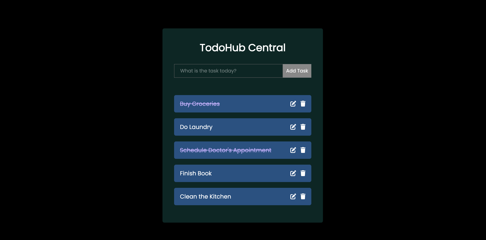

# TodoHub Central

Welcome to TodoHub Central! This is a simple and efficient to-do list application built using React. Stay organized and manage your tasks with ease.

## Table of Contents

- [Demo](#demo)
- [Features](#features)
- [Installation](#installation)
- [Usage](#usage)
- [Contributing](#contributing)
- [License](#license)
- [Contact](#contact)

## Demo

Check out the live demo of TodoHub Central [here](#).



## Features

- Add, edit, and delete tasks
- Mark tasks as completed
- Responsive design for mobile and desktop
- Simple and intuitive user interface

## Installation

To run TodoHub Central locally, follow these steps:

1. Clone the repository:
    ```bash
    git clone https://github.com/Ritulkr/todohub-central.git
    ```
2. Navigate to the project directory:
    ```bash
    cd todohub-central
    ```
3. Install dependencies:
    ```bash
    npm install
    ```

## Usage

To start the development server, run:
```bash
npm start
```
Open your browser and go to `http://localhost:3000` to see the application in action.

### Build

To create a production build, run:
```bash
npm run build
```
The production build will be available in the `build` folder.

## Contributing

Contributions are welcome! Please follow these steps to contribute:

1. Fork the repository
2. Create a new branch (`git checkout -b feature/YourFeature`)
3. Commit your changes (`git commit -m 'Add YourFeature'`)
4. Push to the branch (`git push origin feature/YourFeature`)
5. Open a pull request

## License

This project is licensed under the MIT License. See the [LICENSE](LICENSE) file for more information.

## Contact

If you have any questions or feedback, feel free to reach out:

- Email: kumarritul089@gmail.com
- GitHub: [Ritulkr](https://github.com/Ritulkr)


